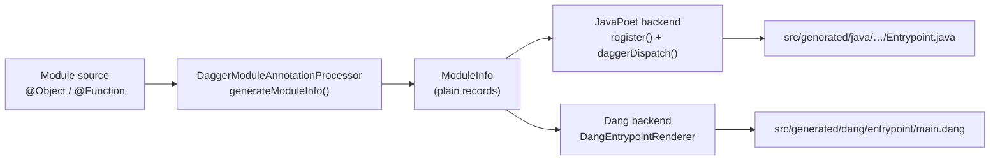

# Manifest v2 prototype for the Java SDK

Status: proposed (inspiration prototype, not intended to merge as-is)
Date: 2026-09-02

## Problem

Dagger is designing a second version of the module manifest. In manifest v2 a
module no longer hands the engine an ambient runtime process that talks back
over `FunctionCall`. Instead the module declares an *entrypoint*: an object that
implements a `ModuleEntrypoint` interface with two fields.

```graphql
"""
Defines and calls one Dagger module.
"""
interface ModuleEntrypoint {
  """Return all types defined by the module."""
  types(workspace: Workspace!): [TypeDef!]!

  """Call one object constructor or function and return its JSON result."""
  call(
    workspace: Workspace!
    receiverType: String!
    receiverValue: JSON
    fnName: String!
    fnArgs: JSON!
  ): JSON!
}
```

`types` replaces the runtime registration round-trip. `call` replaces function
dispatch. There is no third field: the interface has no concept of a main type,
and nothing gives special treatment to the type whose name matches the module's.

The interface, the manifest format and the two entrypoint drivers are specified
in [dagger/dagger#14038](https://github.com/dagger/dagger/pull/14038) (draft,
head `75c777223ccc4baaf5819a04d70d060034a94dbb`), whose branch carries
`future/module-manifest-v2/spec.md`, an example SDK at
`future/module-manifest-v2/example-go-sdk.md`, and a handwritten reference
entrypoint at `.dagger/modules/tiny/entrypoint/main.dang`. Every quotation and
file reference below is read at that commit.

The Go SDK explored the same ground in
[dagger/go-sdk#36](https://github.com/dagger/go-sdk/pull/36) (draft, head
`abd9fe9aa38171a3e71a1285426e1d53f1803ce0`), an explicit inspiration prototype
whose review value is the code-reuse boundary and the shape of the generated
entrypoint. It predates the specification and was written against an earlier
informal draft of the interface, so where the two disagree this document
follows dagger/dagger#14038 and says so.

Nothing equivalent exists for Java. The Java SDK sits in an unusually good
position to test the v2 protocol change on its own, and that is worth knowing
before the v2 design settles.

## Why Java is a cleaner test than Go

Most of dagger/go-sdk#36 is not about manifest v2 at all. It is about
*relocation*: the Go module analyzer lives in the `dagger/dagger` engine
repository, so before the Go SDK can emit a v2 entrypoint it must first port
the analyzer, its source maps, its pragmas, its JSON codecs and its static
dispatcher into the SDK repository. That pull request adds 51 files under
`helpers/module-codegen`. Exactly one of them — `v2.go` — is the manifest-v2
boundary itself. The rest is the move.

The Java SDK has no such relocation to do. Its analyzer is an annotation
processor that already lives in this repository and already runs at build
time:

`sdk/dagger-java-annotation-processor/src/main/java/io/dagger/annotation/processor/DaggerModuleAnnotationProcessor.java`

At commit `be18cc2` that file is 872 lines and does three things that matter
here.

1. `generate()` emits a `register()` method that builds the module's type
   definitions with `Dagger.dag().typeDef().withObject(...)`. This is the same
   type-definition API a v2 `types()` field needs. Today it is emitted as Java
   that calls GraphQL at run time. For v2 the same information must be emitted
   as Dang at generate time.
2. It emits `new Entrypoint().dispatch(Dagger.dag().currentFunctionCall())` —
   the ambient entrypoint that v2 removes.
3. It emits a private `invoke(parentJson, parentName, fnName, inputArgs)`
   method. That method is already a pure static dispatcher in everything but
   its modifiers. It is the natural body of `call`.

So the Java version of this prototype is small and it isolates the protocol
change. That is its value: it answers "what does manifest v2 cost an SDK whose
analyzer is already in the right place", which dagger/go-sdk#36 cannot answer
because its own analyzer move dominates its diff.

## Goals

- Emit a Dang `ModuleEntrypoint` implementation for a Java module, generated
  from the same `ModuleInfo` the annotation processor already builds.
- Emit `types()` as Dang type-definition expressions that describe exactly what
  the existing `register()` method describes at run time.
- Promote the private `invoke` dispatcher to an exported, static
  `daggerDispatch` entry point that reads no ambient `FunctionCall`.
- Add a stdin/stdout JSON dispatch mode to the generated entrypoint, so the
  Dang `call` field can drive the module as a plain process.
- Emit a manifest-v2 manifest body with an `[entrypoint]` table.
- Keep this repository loadable on manifest v1 and engine `v1.0.0-beta.11`.
  The prototype must not require an unreleased engine.
- Keep the v1 dispatch behaviour identical and every existing check green.

Note what the last goal does **not** say. The generated
`io.dagger.gen.entrypoint.Entrypoint` does change for every module: `invoke`
becomes an exported `daggerDispatch`, and `main` gains an argument mode. Those
two edits are the v2 entry point, so gating them would defeat the prototype.
The v1 code path through them is unchanged, and nothing in this repository
compares generated bytes, so all existing checks stay green. A consumer module
that regenerates will see those two edits in its committed
`src/generated/java`.

## Non-goals

- Running a v2 module end to end. This cannot work yet; see "What cannot be
  validated".
- Making `dagger generate` produce v2 artifacts. The v2 entrypoint and
  manifest come from a separate, explicitly invoked function; see "A separate
  function, not a new default". `dagger generate` output does change in one
  respect, described under Goals: the generated `Entrypoint.java` gains an
  exported dispatch method and an argument mode.
- Reconciling with the separate "embed dang runtime" work
  ([dagger/dagger#14018](https://github.com/dagger/dagger/pull/14018),
  [dagger/python-sdk#24](https://github.com/dagger/python-sdk/pull/24)). That
  is a different, already-landed mechanism. It is not touched here.
- Interfaces and source maps. The Java analyzer models neither today, so
  neither has anything to emit. Adding them is ordinary analyzer work,
  unrelated to manifest v2.
- A structured error channel. See "Accepted regression: errors and telemetry".

## Proposed approach

### One analyzer, two backends

The reuse boundary is the point of the prototype, so state it plainly: the
annotation processor keeps its single model of a module (`ModuleInfo`,
`ObjectInfo`, `FunctionInfo`, `ParameterInfo`, `FieldInfo`, `EnumInfo`) and its
single model of a type (`DaggerType`). What changes is that each gains a second
rendering backend.



`DaggerType` already answers "what type definition describes this Java type" as
a JavaPoet `CodeBlock` (`toDaggerTypeDef()`). It gains `toDangTypeDef()`, which
answers the same question as Dang source text. The two are deliberately
parallel, so a reviewer can check by eye that the Dang `types()` and the Java
`register()` describe the same schema.

That parallel has one trap worth naming, because it is the kind of thing a
second backend gets wrong silently. Argument optionality does **not** live in
`DaggerType`. The processor strips `Optional<…>` off a parameter and records
`ParameterInfo.optional()` before `DaggerType` ever sees the type, then appends
`.withOptional(true)` to the argument's type definition itself. The Dang
backend has to do the same, or every optional argument silently becomes
required. Field descriptions are in the same position: `register()` emits them
through `TypeDef.WithFieldArguments`, outside `DaggerType`.

### The generated entrypoint

The renderer emits one Dang type. Here it is in full, for the `Demo` fixture in
`DangEntrypointRendererTest` — one object with a described field, a constructor
with a defaulted argument and a function taking a required, an optional and an
enum-typed argument, plus one enum:

```dang
# This file has been generated by dagger-java-sdk. DO NOT EDIT.

type Entrypoint implements ModuleEntrypoint {
  let jar(workspace: Workspace!): File! {
    container
      .from("maven:3.9.9-eclipse-temurin-21-alpine@sha256:4cbb8bf76c46b97e028998f2486ed014759a8e932480431039bdb93dffe6813e")
      .withoutEntrypoint
      .withMountedCache(
        path: "/root/.m2",
        cache: cacheVolume("sdk-java-maven-m2"),
        sharing: CacheSharingMode.LOCKED,
      )
      .withDirectory("/src", workspace.directory("/"), exclude: ["**/target/**"])
      .withWorkdir("/src/" + workspace.cwd)
      .withExec(["mvn", "package", "-DskipTests", "--threads", "1C", "--no-transfer-progress"])
      # The shade plugin leaves the pre-shaded artifact beside the shaded one.
      .withExec(["sh", "-c", "set -e; jar=$(ls -1 target/*.jar 2>/dev/null | grep -v '/original-' | head -n1); test -n \"$jar\" || { echo \"no packaged jar found in $(pwd)/target\" >&2; exit 1; }; cp \"$jar\" /tmp/module.jar"])
      .file("/tmp/module.jar")
  }

  pub types(workspace: Workspace!): [TypeDef!]! {
    [
      typeDef.withObject("Demo", description: "A demo module")
        .withFunction(
          function("greet", typeDef.withKind(TypeDefKind.STRING_KIND))
            .withDescription("Say hello")
            .withArg("name", typeDef.withKind(TypeDefKind.STRING_KIND), description: "who to greet")
            .withArg("loud", typeDef.withKind(TypeDefKind.BOOLEAN_KIND).withOptional(true))
            .withArg("level", typeDef.withEnum("Severity"))
        )
        .withField("source", typeDef.withObject("Directory"), description: "the source tree")
        .withConstructor(
          function("", typeDef.withObject("Demo"))
            .withArg("prefix", typeDef.withKind(TypeDefKind.STRING_KIND), defaultValue: JSON.decode("\"Hi\""))
        ),
      typeDef.withEnum("Severity")
        .withEnumValue("HIGH", description: "very bad")
        .withEnumValue("LOW")
    ]
  }

  pub call(
    workspace: Workspace!,
    receiverType: String!,
    receiverValue: JSON,
    fnName: String!,
    fnArgs: JSON!,
  ): JSON! {
    let request = JSON.encode({{
      receiverType: receiverType,
      receiverValue: receiverValue,
      fnName: fnName,
      fnArgs: fnArgs,
    }})
    let result = container
      .from("eclipse-temurin:21-jre-alpine")
      .withoutEntrypoint
      .withFile("/opt/module/module.jar", jar(workspace))
      .withWorkdir("/opt/module")
      .withExec(
        ["java", "-jar", "/opt/module/module.jar", "engine-call"],
        stdin: request,
        experimentalPrivilegedNesting: true,
      )
      .stdout
    (result :: JSON!)
  }
}
```

`types` is a list of type-definition expressions, one per `@Object` and one per
`@Enum`, built with the same `withObject` / `withFunction` / `withField` /
`withConstructor` / `withEnum` / `withEnumValue` calls the Java `register()`
method uses.

`jar` builds the module into a runnable artifact — the Go prototype names the
same field `dispatch` because there it builds an executable. For Java it is a
Maven build producing a shaded jar, which is what
`github.com/dagger/java-sdk/runtime` already does at
`runtime/main.dang:moduleRuntime`. The generated Dang inlines the same build
rather than calling the runtime module, because in manifest v2 there is no
runtime module left to call: the entrypoint *is* the contract.

`call` encodes its arguments as a JSON request, runs the built jar with the
`engine-call` argument, feeds the request on standard input, and returns
standard output as the result. Standard output already holds JSON text, so it
is cast to `JSON!` rather than decoded — the same shape the specification's
example SDK uses.

`types` returns every type the module defines, the class that plays the role of
a main class included. The interface has no separate field for it. The engine
finds the module's entry object by looking for the type that declares a
constructor.

### The generated Java side

`Entrypoint` keeps everything it has today and gains two things.

- `invoke` becomes `public static JSON daggerDispatch(JSON parentJson, String
  parentName, String fnName, Map<String, JSON> inputArgs)`. The v1
  `dispatch(FunctionCall)` path calls it, so v1 behaviour is unchanged. It
  reads no ambient state, which is what "immutable entry point" means in
  dagger/go-sdk#36's `DaggerDispatch`.
- `main(String[] args)` gains an `engine-call` mode. With no arguments it is
  exactly today's ambient v1 entrypoint. With `engine-call` it delegates to
  `io.dagger.client.ModuleDispatcher`, which reads one JSON request object from
  standard input, dispatches it, and writes the JSON result to standard output.

`ModuleDispatcher` lives in `io.dagger.client` rather than `io.dagger.module`
because `Scalar.convert()`, the only raw accessor for the `JSON` result, is
package-private there; the public alternative round-trips through JSON-B and
would double-encode the result.

`ModuleDispatcher` is hand-written SDK code, not generated text. That is
deliberate, and it is the second half of the reuse boundary this prototype
wants reviewed: dagger/go-sdk#36 *generates* a whole `cmd/<module>-dispatch`
command per module, because a Go module's root package must stay importable and
so cannot itself be `package main`. Java has no such constraint — the generated
`Entrypoint` is already the shaded jar's `Main-Class` — so the protocol can be
a fixed library class and the generated code stays three lines long. Only the
parts that genuinely depend on the module's shape are generated.

The request is the JSON form of the `call` arguments:

```json
{
  "receiverType": "DaggerModule",
  "receiverValue": "{\"prefix\":\"Hi\"}",
  "fnName": "greet",
  "fnArgs": "{\"name\":\"World\"}"
}
```

Note the two quoted fields. `receiverValue` and `fnArgs` cross
`ModuleEntrypoint.call` as `JSON` scalars, so the entrypoint's `JSON.encode`
writes them into the request as strings holding JSON text. `ModuleDispatcher`
decodes each once. That is the specification's own worked example, and it is
easy to get wrong in the other direction: an inline object here would make
`fnArgs` unreadable and a Java `String` argument arrive with literal quote
characters around it.

Inside `fnArgs`, each key is an argument's original name and each value uses
the SDK's ordinary input encoding — embedded as JSON, not as a JSON-encoded
string. A missing key means the argument was omitted with no resolved default;
a null value means the argument value is null.

`receiverType` is non-null and names the owning object type even for a
constructor, which arrives as an empty `fnName`. `receiverValue` is nullable in
the interface, but a constructor does not send a JSON null here: the engine
marshals its absent receiver to the JSON *text* `null`, which arrives as the
string `"null"` like any other receiver state. `ModuleDispatcher` substitutes
`{}` only when the field is genuinely absent or JSON-null. Both `receiverValue`
and `fnArgs` are parsed to prove they are well-formed JSON before dispatch,
because the generated dispatcher ignores the receiver on a constructor call and
would otherwise accept malformed text without noticing.

`engine-call` opens no Dagger session by itself. `Dagger.dag()` connects on its
first call, and the `engine-call` path never calls it, so a module function
that does not use the client dispatches in a plain JVM with no engine present.
That is call-path isolation, not a lazy connection, so the fixture check proves
it by running the jar in a plain Maven container that never had a session. The
check is in fact stricter than real v2 operation: the generated `call()` passes
`experimentalPrivilegedNesting: true`, so a v2 dispatch would have a session
available to it.

### A separate function, not a new default

dagger/go-sdk#36 replaces the Go SDK's default generation path outright, and
adds `GoSdk.generateV2` as a second, explicitly invoked entry point for
development while the engine loader is incomplete. This prototype keeps only
the second half: a `JavaSdk.generateV2(ws, path)` function that is not marked
`@generate` and so never runs as part of `dagger generate`.

The reason is not test insulation. The SDK contract checks in `dagger/sdk-sdk`
and this repository's own `e-2-e:init-check` constrain `initModule`, not
generation, and dagger/go-sdk#36 writes a v2 manifest from its generator with
those same checks green. The reason is that the v2 entrypoint is dead weight in
every module that has one until an engine can load it. `dagger generate` runs
over every managed module in the workspace, including this repository's own, and
each run would build and commit a Dang file naming a `ModuleEntrypoint`
interface that engine `v1.0.0-beta.11` does not have. A leaf function keeps the
artifacts reachable for review without putting them in everybody's tree. It
costs a reviewer nothing: the emitted artifacts, which are the design input, are
identical either way.

### The manifest

`generateV2` writes a manifest of the v2 shape:

```toml
manifestVersion = 2
name = "hello"

[entrypoint]
kind = "dang"
source = "./src/generated/dang/entrypoint"
```

The file is named `dagger-module.v2.toml`. In a real v2 world it is
`dagger-module.toml`, and dagger/go-sdk#36 does write that name. Here it must
not, and the reason is mechanical rather than cosmetic.

`generateV2` gets the module's introspection schema the only way this SDK can:
`Workspace.moduleSource(path).introspectionSchemaJSON`, which asks the engine to
load the target module. Engine `v1.0.0-beta.11` loads manifest v1. If
`generateV2` replaced the target's `dagger-module.toml` with a v2 body, then
after applying that changeset the module would no longer load, and `generateV2`
could never be run on it a second time — including by the check that exercises
it. Replacing the manifest would also drop the `[[dependencies]]` tables the v2
body does not model.

dagger/go-sdk#36 does not hit this because its `generateV2` deliberately avoids
loading the target at all: it takes the module name and engine version as
explicit arguments and generates against a bundled beta.11 core-schema fixture
(`--core-only`). This SDK has no bundled schema to generate from, so it keeps
the v1 manifest working and writes the v2 body beside it. The content is the
design input; the filename is not.

Those three top-level keys are the whole manifest, and the whole manifest is
those three keys. `validateModuleManifestV2TOML` in `core/modules/config.go`
rejects any other with `dagger-module.toml manifest version 2 does not support
"<key>"`. `engineVersion` in particular is a legacy runtime field and is not
carried over. `entrypoint.kind` must be `dang` or `module`.

dagger/go-sdk#36 emits `driver` rather than `kind`, and emits `engineVersion`.
Both predate the specification. This prototype follows the specification.

`name` comes from `ModuleSource.moduleOriginalName`, the name as written in the
module's own configuration, rather than `moduleName`, which reflects any rename
applied while loading.

`source` points at `./src/generated/dang/entrypoint`, where dagger/go-sdk#36
uses `./internal/dagger/entrypoint`. `internal/` is a Go visibility convention
with no meaning in Java, and this repository already marks `/src/generated/**`
as generated in the module template's `.gitattributes` and already drops
`src/generated` wholesale before regenerating, so a stale Dang entrypoint is
cleaned for free. Putting the emitted Dang there makes it obviously SDK-owned
output, next to `src/generated/java`.

## Four known gaps in the v2 interface

These are properties of the v2 interface as specified in dagger/dagger#14038,
not of this implementation. Two of them were first read the wrong way against
dagger/go-sdk#36's generated output, before the specification existed; each
says so.

### 1. Accepted regression: errors and telemetry

`call(...): JSON!` is non-nullable and has no error field. There is nowhere to
put a structured error. The Go prototype's generated entrypoint contains no
equivalent of the engine `returnError` call at all: a module error becomes a
plain exec failure.

For Java the loss is larger than for Go, because the v1 Java entrypoint carries
more in that channel. Its `dispatch` method calls `fnCall.returnError` in three
places:

- `DaggerExecException` — attaches `stdout`, `stderr`, `cmd`, `exitCode` and
  `path` as structured values on the error. This is the substantial one: a
  failed `withExec` inside a module function reports what actually ran and what
  it printed.
- `InvocationTargetException` — reports the *target* exception's message. In
  the generated dispatcher this wrapper is raised in exactly one place, for an
  unknown function name; module functions are invoked directly, not
  reflectively, so an author's own exception is not wrapped.
- any other `Exception` — reports its message.

There is a second loss of the same kind, easy to miss. The v1 `main` wraps
dispatch in `try (Telemetry telemetry = new Telemetry())`, which initialises the
OpenTelemetry exporter and installs the trace context named by the `TRACEPARENT`
environment variable as current. An `engine-call` dispatch does neither. Go
loses the same thing: its `engine-call` path skips the telemetry initialisation
its legacy dispatch performs.

Be precise about what this is. It is not the loss of an existing per-call span —
the generated dispatcher never calls `Telemetry.trace(...)`, so no span is
created on either path today. And it is not something `call(...): JSON!`
forbids: trace context and the exporter endpoint travel through environment
variables, which survive an exec. It is an implementation regression that a
finished v2 SDK would have to undo, and it is worth recording because it is easy
to reach the end of a v2 port without noticing that telemetry setup went with
the ambient entrypoint.

This prototype does not pretend to preserve any of it. `engine-call` degrades
as follows:

- The process exits non-zero, which is what the engine will see. The outer Dang
  `.withExec` fails before its result is ever cast to `JSON!`. That is the
  specified path — "a failure is a GraphQL error. It is not a JSON result" —
  so the *fact* of a failure and its message do reach the caller. What has
  nowhere to go is everything else.
- Before exiting, it writes one JSON object to standard error carrying the
  fields the v1 path attached to the error value: `message`, `type`, and, for
  `DaggerExecException`, `stdout`, `stderr`, `cmd` (a list), `exitCode` and
  `path` (a list).

That envelope is **not** a mitigation and is not a protocol. Nothing consumes
it, and standard error is not part of the `call` contract. It exists so this
prototype has a concrete, executable answer to the question "what would an SDK
need an error channel to carry", instead of an assertion in a document.
To be precise about the size of the claim: v2 does not lose errors, it loses
*structured* errors. A failing module still fails the call, and the exec error
carries whatever the process wrote. What disappears is the typed `Error` value
v1 builds with `.withValue("stdout", …)` and friends, which a caller could read
field by field.

**If manifest v2 ships with `call(...): JSON!` unchanged, every SDK loses
structured module errors.** That is the single most important thing this
prototype has to say.

### 2. Java has a main type; manifest v2 does not

This is the gap that matters most for Java, and it runs the opposite way to
what a first reading suggests.

The specification is explicit that the interface has no main type. `types`
returns every type the module defines, the engine finds the entry object by
looking for the type that declares a constructor, and it does not compare any
name with the module's:

> The manifest does not define a main type. A type does not need the same name
> as the module. […] For `dagger call`, the engine exposes the fields and
> functions of the object that the constructor returns. The engine does not
> call this object a main type. It does not compare the object name with the
> module name.

Java's analyzer does exactly what that paragraph rules out. In
`DaggerModuleAnnotationProcessor.generateModuleInfo` it computes
`boolean mainObject = areSimilar(name, moduleName)` and records a constructor
only `if (mainObject)`. `areSimilar` normalises case, hyphens and underscores,
so the object named like the module is the only one that can carry a
constructor into `ModuleInfo`.

Two consequences, and they pull in different directions.

The engine's current limit — "the initial engine supports zero or one object
constructor", rejecting more with `multiple object constructors are not
supported: <names>` — is satisfied by Java for free. It cannot emit two, so it
cannot trip the check. An `e-2-e` assertion pins that on the real generated
artifact rather than trusting the reading.

But the same gate is a restriction v2 does not impose. A Java module cannot
today say "the entry object is `Builder`, not `MyModule`", which manifest v2
allows and which needs no manifest change. And when the engine lifts its
one-constructor limit — the specification says "a future engine can expose more
object constructors without a manifest change" — Java will not follow, because
the constraint is in the analyzer, not in anything v2 owns.

Nothing in this prototype changes that: relaxing `mainObject` would alter what
the v1 entrypoint registers, which is out of scope here. It is recorded because
it is invisible from the entrypoint end. Reading the generated Dang, a module
with one constructor looks exactly like a module that had a free choice.

### 3. Name casing in `call` — specified, and this SDK already matched it

An earlier reading of the interface treated argument casing as an undocumented
assumption. It is not. The specification names both fields by their original
names — `receiverType` is "the original name of the receiver object type" and
`fnName` is "the original function name" — and gives constructors the empty
string. Each `fnArgs` key is "an original argument name".

Java's existing dispatcher already switches on exact `objectInfo.name()` and
`fnInfo.name()`, and the processor records original names, so `daggerDispatch`
satisfies this without change. Recorded here because the opposite was believed
before the specification landed, and because it is the one place where the
Go prototype's two entry paths disagree: its developer-facing `call` mode
normalises names, its engine-facing `engine-call` mode does not. Only the
latter implements this interface.

### 4. Module description has nowhere to go

`register()` today calls `module().withDescription(...)`. `types()` returns
`[TypeDef!]!` with no module-level object, and the manifest carries only a
name, so a module's own description has no home anywhere in v2. The Go
prototype drops it silently. This prototype drops it too, and says so here.

## What cannot be validated

A generated v2 entrypoint cannot run end to end today, and no amount of effort
here changes that:

- The manifest-v2 loader exists only on the dagger/dagger#14038 branch. Its own
  author describes it as draft and untested.
- The generated Dang references `ModuleEntrypoint`, which is not in any release
  and so not in engine `v1.0.0-beta.11`.
- The generated Dang references `Workspace.cwd`, likewise.

dagger/go-sdk#36 has the same limit and validates the same way: unit tests plus
a generated fixture exercised directly. This prototype does the same. What it
can do, and does, is exercise the specified transport for real — the fixture
check sends the request shape the specification documents and runs the built
jar against it.

## Validation

1. **Unit tests** in `sdk/`, run by the existing `packager:unit-tests` check
   (`mvn -Ptests test` over the whole SDK reactor):
   - `DaggerTypeDangTest` — `toDangTypeDef()` for every `DaggerType` subclass,
     driven through the `DaggerType.of` factory rather than the subclass
     constructors, so a type the factory never produces cannot pass by
     accident.
   - `ModuleDispatcherTest` — request round trip with `receiverValue` and
     `fnArgs` as JSON text, the constructor shape (`receiverValue` the text
     `null`), rejection of a missing `receiverType`, `fnName` or `fnArgs`, of
     `fnArgs` sent inline rather than as JSON text, of trailing data both
     around and inside the request, and of malformed receiver text, a dispatch
     that prints to standard output, and each error shape on standard error
     with a non-zero return.
   - `DangEntrypointRendererTest` — the rendered `types()`, `call()` and
     `jar()` bodies, the absence of a `main` field, the `call` signature, the
     `experimentalPrivilegedNesting` flag, the jar selection in `jar`, that
     exactly one type declares a constructor, and an escaping case with quotes,
     backslashes and a newline in a description.
2. **A generated fixture, exercised directly**, as new `e-2-e` checks:
   - assert the emitted `main.dang` declares `implements ModuleEntrypoint` with
     `types` and `call` and no `main`, that `call` takes `receiverType:
     String!` and `fnArgs: JSON!`, and that `dagger-module.v2.toml` carries
     `manifestVersion = 2`, `kind = "dang"` and no `engineVersion`;
   - `mvn package` the fixture and run its shaded jar as
     `java -jar <jar> engine-call < request.json` in a plain Maven container
     with no Dagger session, asserting the JSON result. This is the Java
     analogue of running the Go prototype's generated dispatcher in
     `engine-call` mode, and it is a real execution of the generated
     dispatcher, not a string comparison.
3. **No regression**: `dagger generate` emits no v2 artifacts, and the two
   edits it does make to `Entrypoint.java` leave the v1 code path intact, so
   `dagger check` passes unchanged.

## Alternatives considered

**Emit the Dang entrypoint from `mod.dang` instead of the annotation
processor.** Rejected. `mod.dang` has no model of the module's types; it would
have to re-analyze Java source, which is precisely the duplication this
prototype exists to avoid. The processor already holds `ModuleInfo`.

**Generate a separate dispatch executable, mirroring Go's
`cmd/<module>-dispatch`.** Rejected; see "The generated Java side".

**Wire v2 generation into `dagger generate` behind a boolean setting.**
Rejected in favour of a separate `generateV2` function. A setting has to be
threaded through `Mod` and injected from a workspace `dagger.toml`, which no
check in this repository exercises today, and it would make the v2 path a
variant of the default path rather than a clearly separate one. The function
form is also what dagger/go-sdk#36 uses for its own engine-independent
development path.

**Emit `withEnumMember`, as the Go prototype does.** Rejected. This SDK pins
engine `v1.0.0-beta.11`, whose `TypeDef` exposes `withEnumValue`, and the Java
`register()` method emits `withEnumValue`. Matching the SDK's own pinned schema
keeps the Dang and Java backends comparable, which is the property the
prototype is trying to demonstrate. The divergence from the Go prototype is
cosmetic and is noted here so a reviewer is not surprised by it.

## Affected components

| Path | Change |
| --- | --- |
| `sdk/dagger-java-annotation-processor/.../DaggerType.java` | add `toDangTypeDef()` |
| `sdk/dagger-java-annotation-processor/.../Dang.java` | new: Dang string quoting and indentation |
| `sdk/dagger-java-annotation-processor/.../DangEntrypointRenderer.java` | new: `ModuleInfo` to Dang source |
| `sdk/dagger-java-annotation-processor/.../DaggerModuleAnnotationProcessor.java` | export `daggerDispatch`; add `engine-call` mode; write `main.dang` through the `Filer` |
| `sdk/dagger-java-sdk/.../io/dagger/client/ModuleDispatcher.java` | new: the stdin/stdout call protocol |
| `mod.dang` | `generateV2Module`: stage the Dang entrypoint and the v2 manifest |
| `main.dang`, `main.dang.tmpl` | expose `generateV2`; the root Dang file is generated from the template, so both change |
| `.dagger/modules/e2e/main.dang` | two new checks |
| `hack/designs/` | this document |

## Risks

- **The v2 interface is still moving.** Every field name here may change. The
  prototype is written to be cheap to discard: `generateV2` is a leaf function,
  and the two edits to the generated Java entrypoint are additive.
- **The emitted Dang is unparsed by anything.** Until an engine can load it, a
  syntax error in the renderer is only caught by the unit tests' expected
  strings. This is the same exposure dagger/go-sdk#36 carries. String escaping
  is therefore centralised in one routine with an adversarial test, because
  that is where an unparsed generator most easily produces garbage.
- **The `engine-call` transport shares standard output with module code.** A
  module function that prints to standard output would corrupt the JSON result.
  `ModuleDispatcher` redirects `System.out` to standard error for the duration
  of the dispatch and writes its result to the original stream. Go's prototype
  has the same exposure and does not handle it.
- **`jar` duplicates the runtime's Maven build.** If `runtime/main.dang`
  changes, the emitted Dang does not follow. Acceptable for a prototype; in a
  real v2 world the duplication disappears with the runtime module.
- **The error regression is real.** It is documented above rather than hidden,
  and it is the finding this prototype most wants reviewed.

## Progress

This section is run bookkeeping so an interrupted attempt can resume. It is not
part of the design.

- Base commit: `be18cc2` on `main`.
- Status: the six patches below are written; `dagger check` passes.

---

# Implementation plan

## Patch series

Six Stacked Git patches. Each builds in stack order; patch 4 depends on the
class patch 3 adds.

| # | Name | Content |
| --- | --- | --- |
| 1 | `design: manifest v2 prototype for the Java SDK` | this document |
| 2 | `processor: render Dagger types as Dang type definitions` | `DaggerType.toDangTypeDef()` + tests |
| 3 | `sdk: dispatch a module call from a JSON request` | `io.dagger.client.ModuleDispatcher` + tests |
| 4 | `processor: export a static dispatch entry point` | `invoke` becomes `public static daggerDispatch`; `main` gains `engine-call` |
| 5 | `processor: emit a Dang module entrypoint` | `DangEntrypointRenderer` + `Filer` output + tests |
| 6 | `java-sdk: generate a manifest v2 entrypoint and manifest` | `main.dang`, `mod.dang`, two e2e checks |

## Patch 2 — `DaggerType.toDangTypeDef()`

File: `sdk/dagger-java-annotation-processor/.../DaggerType.java`

Add one abstract method, `String toDangTypeDef()`, implemented on each of the
seven subclasses so it mirrors `toDaggerTypeDef()`:

| Subclass | Dang |
| --- | --- |
| `Kind` | `typeDef.withKind(TypeDefKind.STRING_KIND)`, `.withOptional(true)` when void |
| `Scalar` | `typeDef.withScalar("Platform")` |
| `Enum` | `typeDef.withEnum("Severity")` |
| `Object` | `typeDef.withObject("DaggerModule")` |
| `List` | `typeDef.withListOf(<inner>)` |
| `Array` | `typeDef.withListOf(<inner>)` |
| `Optional` | `<inner>.withOptional(true)` |

The integer/float collapsing (`byte`/`short`/`int`/`long` to `INTEGER_KIND`,
`float`/`double` to `FLOAT_KIND`) is shared with `toDaggerTypeDef()` by
extracting the existing `switch` into a private `kindName()` helper on `Kind`,
so the two backends cannot drift. `Kind` also maps `char`, but the
`DaggerType.of(TypeInfo)` factory does not classify `char`, so no module
parameter ever reaches that branch. That pre-existing gap is left alone: it is
unrelated to manifest v2.

`DaggerType.of` consults the mutable static `knownEnums` set to decide whether
a named type is an enum. `DangEntrypointRenderer.render` must therefore set it
from `ModuleInfo.enumInfos().keySet()` before rendering, exactly as
`DaggerModuleAnnotationProcessor.process` does today. Setting that static is an
observable side effect, so the renderer is deterministic and self-contained
rather than pure.

Tests (`DaggerTypeDangTest`): one assertion per subclass, every case built
through `DaggerType.of(...)` rather than a subclass constructor; a nested
`Optional<List<String>>`; and an enum-typed value, which only renders correctly
when `knownEnums` is populated.

## Patch 3 — `io.dagger.client.ModuleDispatcher`

New file: `sdk/dagger-java-sdk/src/main/java/io/dagger/client/ModuleDispatcher.java`

This is the code-reuse boundary the prototype most wants reviewed: the
stdin/stdout protocol is hand-written SDK code, so the generated entrypoint
stays three lines long.

```java
public final class ModuleDispatcher {
  @FunctionalInterface
  public interface Dispatch {
    JSON call(JSON parentJson, String parentName, String fnName, Map<String, JSON> inputArgs)
        throws Exception;
  }

  public static void engineCall(InputStream in, PrintStream out, Dispatch dispatch) throws Exception;
  public static int engineCallMain(Dispatch dispatch);
}
```

It lives in `io.dagger.client`, not `io.dagger.module`, for one reason worth a
comment in the source: the result is a `JSON` scalar, and the only accessor for
a `Scalar`'s raw value, `Scalar.convert()`, is package-private to
`io.dagger.client`. Writing the result from another package would mean
re-serialising it and double-encoding the JSON.

- `engineCall` reads one JSON object from `in` with `jakarta.json`, not JSON-B:
  argument values are raw JSON that must round-trip verbatim, and `JsonValue`
  preserves them where a bound type would not.
- Request fields: `receiverType`, `receiverValue`, `fnName`, `fnArgs`.
  `receiverType` and `fnName` are non-null in the interface and are required
  here; a missing `receiverType` or `fnName` would silently dispatch something
  else. `receiverValue` and `fnArgs` arrive as JSON strings holding JSON text,
  because they cross `call` as `JSON` scalars and the entrypoint's
  `JSON.encode` writes them that way; each is decoded once. A null or absent
  `receiverValue` becomes `JSON.from("{}")`, the empty receiver encoding of a
  constructor call. `fnArgs` is required and must be JSON text holding an
  object; sending it inline is rejected rather than read as no arguments.
  Anything after the request object is rejected too.
- For the duration of the dispatch, `System.out` is redirected to
  `System.err`, and the result is written to the `PrintStream` captured before
  the redirect. Module code that prints would otherwise corrupt the single JSON
  value the caller decodes.
- `engineCallMain` wraps `engineCall`, returns `0`, and on any exception writes
  the error envelope to `System.err` and returns `2`.

The error envelope, which exists only as design evidence because
`call(...): JSON!` has no error field (see "Accepted regression: errors and
telemetry"):

```json
{
  "message": "...",
  "type": "io.dagger.client.exception.DaggerExecException",
  "stdout": "...",
  "stderr": "...",
  "cmd": ["..."],
  "exitCode": 1,
  "path": ["..."]
}
```

`cmd` and `path` are lists: `DaggerExecException.getCmd()` and `getPath()` both
return `List<String>`. `InvocationTargetException` is unwrapped to its target's
message first, which is what the v1 path does for the one case that raises it.

Tests (`ModuleDispatcherTest`): a round trip through a stub `Dispatch`;
verbatim preservation of a raw JSON argument; the constructor shape
(`receiverType` set, `fnName` empty, `receiverValue` null); rejection of a
missing `receiverType`, `fnName` or `fnArgs`, of `fnArgs` sent inline rather
than as JSON text, and of trailing data; a dispatch that prints to standard
output, asserting the result still parses; and each of the three error shapes
on standard error with a non-zero return.

## Patch 4 — exported static dispatch

File: `sdk/dagger-java-annotation-processor/.../DaggerModuleAnnotationProcessor.java`

1. The `invoke` `MethodSpec` becomes `public static`, named `daggerDispatch`.
   Its body is unchanged, so `Optional<T>` returns keep serialising through
   `res.orElse(null)`. The v1 `dispatch(FunctionCall)` method calls
   `daggerDispatch(...)` instead of `invoke(...)`.
2. `main(String[] args)` becomes:

```java
public static void main(String[] args) throws Exception {
  if (args.length > 0 && "engine-call".equals(args[0])) {
    System.exit(ModuleDispatcher.engineCallMain(Entrypoint::daggerDispatch));
  }
  try (Telemetry telemetry = new Telemetry()) {
    new Entrypoint().dispatch(dag().currentFunctionCall());
  } finally {
    dag().close();
  }
}
```

The `engine-call` branch exits before the telemetry block. That is the
telemetry loss recorded in gap 1, not an oversight: there is no session to
attach spans to.

## Patch 5 — `DangEntrypointRenderer`

New file:
`sdk/dagger-java-annotation-processor/.../DangEntrypointRenderer.java`

`static String render(ModuleInfo moduleInfo)`. Deterministic in its argument and free of `javax.lang.model`, so it is directly
unit testable from hand-built records. Structure mirrors `v2.go`'s `renderEntrypointSource`:

- `renderObject(ObjectInfo)` — `typeDef.withObject("X", description: "...")`
  then `.withFunction(...)` per function, `.withField(name, <type>,
  description: "...")` per field, `.withConstructor(...)` when present.
- `renderEnum(EnumInfo)` — `typeDef.withEnum("X")` then `.withEnumValue(...)`.
- `renderFunction(FunctionInfo)` — `function("name", <returnType>)` then
  `.withDescription`, `.withCheck`, `.withGenerator`, `.withUp`, and one
  `.withArg(name, <type>[.withOptional(true)][, description:][, defaultValue:][, defaultPath:][, ignore:])`
  per parameter. The `.withOptional(true)` comes from
  `ParameterInfo.optional()`, not from `DaggerType`. The constructor renders
  with the empty name and the owning object as its return type, matching
  `withFunction` in the JavaPoet backend.
- Argument default values reuse the string `ParameterInfo.defaultValue()`
  already carries (the processor has quoted strings there), emitted as
  `defaultValue: JSON.decode("...")`.
- Every string that reaches the output goes through one `Dang.quote` routine
  that escapes `"`, `\`, and control characters including newlines. Javadoc
  descriptions are multi-line and would otherwise emit invalid Dang. Both
  backends share it, so `DaggerType.toDangTypeDef` quotes type names the same
  way.

The processor then writes the rendered source through the `Filer`:

```java
FileObject dang = processingEnv.getFiler()
    .createResource(StandardLocation.CLASS_OUTPUT, "", "dagger/entrypoint/main.dang");
```

`CLASS_OUTPUT` rather than `SOURCE_OUTPUT`: `SOURCE_OUTPUT` is captured
wholesale as `src/generated/java`, and a `.dang` file is not Java source. Only
the second compiler execution in the module pom runs annotation processing, so
there is no second pass to clobber the resource.

Tests (`DangEntrypointRendererTest`): a hand-built `ModuleInfo` with one object
(a described field, a constructor with a defaulted argument, a function with a
required, an optional and an enum-typed argument) and one enum. Assertions on
`implements ModuleEntrypoint`, the two field signatures, the absence of a
`main` field, the whole `types()` block pinned verbatim, and the `call` and
`jar` bodies — the `call` signature, the `experimentalPrivilegedNesting` flag,
the request construction, the `(result :: JSON!)` cast and the jar selection. A
second case asserts that exactly one type declares a constructor, which is what
the engine looks for; a third renders a description containing a quote, a
backslash and a newline.

## Patch 6 — generation and checks

`mod.dang`:

- `generatedEntrypoint(moduleDir, name)` is split so the built container is
  bound once: the Java sources come from
  `/module/target/generated-sources/annotations` and the Dang entrypoint from
  `/module/target/classes/dagger/entrypoint/main.dang`.
- a new `generateV2Module(ws)` reuses `generateModule`'s pipeline and stages:
  - `<module>/src/generated/dang/entrypoint/main.dang`
  - `<module>/dagger-module.v2.toml`, written with `withNewFile` and carrying
    only `manifestVersion`, `name` and `[entrypoint]`. `name` comes from
    `modSource.moduleOriginalName`, passed through a `tomlString` helper
    covering all seven TOML basic-string escapes. The v1 `dagger-module.toml` is left
    in place; see "The manifest" for why.
  - `<module>/sdk/repo`, when the workspace sets `vendorSdkJar`, exactly as the
    default path stages it. `generateV2` replaces nothing the default path
    produces; it adds two files to it.

`main.dang`: `pub generateV2(ws: Workspace!, path: String! = "."): Changeset!`,
with no `@generate` directive, so it never runs as part of `dagger generate`.
It cleans `path` through `Mod.cleanModulePath`, which rejects embedded
traversal such as `a/../../x`, rather than the weaker inline check `initModule`
carries. The same text is added to `main.dang.tmpl`: the `templates` module
regenerates `main.dang` from that template and its check fails on any drift.

`.dagger/modules/e2e/main.dang`: two checks, both reusing the existing
`generate/app` fixture with the manifest-v2 module source overlaid in memory —
the same technique `nullableReturnCheck` uses, and for the same reason: adding
a sixth managed module would break the exact-count assertions in
`modulesCheck` and `modulesCwdCheck`.

- `manifestV2Check` — asserts the emitted `main.dang` and
  `dagger-module.v2.toml` contents, and that the module's v1
  `dagger-module.toml` is not modified.
- `manifestV2DispatchCheck` — `mvn package`s the fixture, then runs
  `sh -c 'jar=$(ls -1 target/*.jar | grep -v "/original-" | head -n1); java -jar "$jar" engine-call < /request.json'`
  and asserts the result. The `original-` exclusion is the same one
  `runtime/main.dang` documents: the shade plugin leaves the pre-shaded
  artifact in `target/`, so a bare `target/*.jar` glob expands to two paths and
  pushes `engine-call` out of `args[0]`. The container carries no Dagger
  session, which proves the dispatch needs no engine.

## Test strategy

| Level | What | Runs in |
| --- | --- | --- |
| Unit | `DaggerTypeDangTest`, `ModuleDispatcherTest`, `DangEntrypointRendererTest` | `packager:unit-tests` |
| Fixture | `e-2-e:manifest-v-2-check` — generated artifact contents | `dagger check` |
| Fixture | `e-2-e:manifest-v-2-dispatch-check` — the generated dispatcher actually runs | `dagger check` |
| Regression | every existing check; `dagger generate` emits no v2 artifacts | `dagger check` |

There is no end-to-end check, and there cannot be one; see "What cannot be
validated".

## Order of work

1. Patch 2, with tests. Verify with `mvn -Ptests test`.
2. Patch 3, with tests. Same verification.
3. Patch 4. Verify the generated v1 entrypoint differs only in the two intended
   edits.
4. Patch 5, with tests.
5. Patch 6. Verify with `dagger check`.
6. Patch 1 is written first but refreshed last, so the document matches what
   was built.
