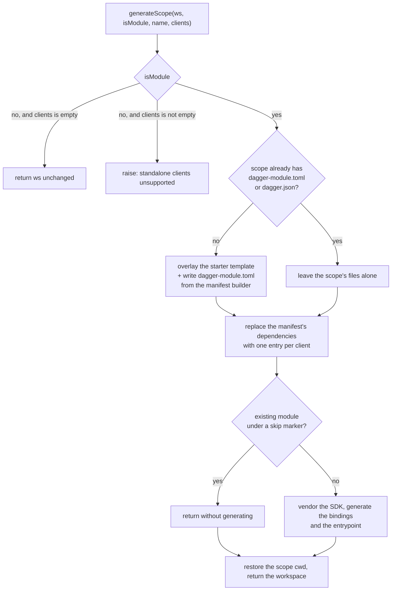

# Adopt the module-max SDK interface

Status: proposed
Date: 2026-09-04

## Reviewed baselines

Every claim in this document was checked against these exact revisions.

| What | Revision |
| --- | --- |
| This repository (`dagger/java-sdk`), base of the change | `be18cc2d64951628a79ae7da626ab2427b6a2436` |
| The engine change, `dagger/dagger#13992`, branch `sdk-ux-module-max` | `78c241b6ce5f950461c74811e768f92e946e2ca7` |
| The precedent, `dagger/python-sdk#25`, head | `c05426e0fbef5d758184667d62ddc406591b8192` (merged as `d8f8eca33c75c1113ba8412b3d3ad626a0c9b0ef`) |
| The released engine and CLI this repository's CI runs | `v1.0.0-beta.11` |

`sdk-ux-module-max` is force-pushed regularly. Every reference to it below means
the commit in this table, not the branch head at the time of reading.

## Problem

`dagger/dagger#13992` changes the contract between the engine and an SDK module.
It ships no compatibility adapter. On an engine built from that change, this
repository's root module cannot serve as the Java SDK at all.

Three removals break it:

- `CurrentModule.asSDK` is gone. `JavaSdk.modules` selects it, so module
  discovery has no source.
- The beta SDK-module interface — `initModule`, `targetRuntime`, and the
  `@generate` hook — is gone. `JavaSdk.initModule`, `JavaSdk.targetRuntime`, and
  `JavaSdk.generateAll` implement exactly that interface.
- `ModuleSource.generateLocalDependencies` is gone. `Mod.generateModule` selects
  it to stage a module's local dependencies before code generation.

The replacement is two required functions and one optional one, declared in
`core/sdkmodule/provider.go`:

- `detectScope(ws: Workspace!): String!` returns the workspace-relative path of
  the nearest scope that contains the workspace cwd, or `""` when there is none.
- `generateScope(ws: Workspace!, isModule: Boolean!, name: String!, clients: [ModuleSource!]!): Workspace!`
  receives a workspace whose cwd is already the scope, and returns the complete
  scope: the starter template and a module manifest when the scope is new, and
  freshly generated bindings always. The `clients` list becomes the scope's
  dependency set.
- `defaultModulePath(ws: Workspace!, name: String!): String!` is optional. See
  Non-goals.

The engine validates the names, order, and types of those arguments exactly, so
they are not negotiable.

Registration moves with the interface. An SDK is recorded as
`[sdks.<name>] module = "<installed-module-name>"` in `dagger.toml`, and each
managed scope as `[sdks.<name>.scopes."<path>"]`.

Three sibling SDKs have already adopted the same interface the same way:
`dagger/python-sdk#25` (merged), `dagger/go-sdk#37`, and `dagger/dang-sdk#13`.

## Goals

1. Implement `detectScope` and `generateScope`, and delete the beta interface
   they replace.
2. Write a module's `dagger-module.toml` through the engine's manifest builder,
   so dependency editing stays the engine's business.
3. Turn a module scope's client list into the module's dependency set, so the
   generated Java bindings carry each client's types.
4. Re-register this SDK and the end-to-end fixtures under `[sdks.java]`.
5. Prove the result against a real engine built from `sdk-ux-module-max`, in CI.
6. Keep pre-1.0 `dagger.json` modules working: a module that already has a
   config keeps the runtime it already names.
7. Leave the pull request's CI green, rather than merging it red as
   `dagger/python-sdk#25` did.

## Non-goals

- **Standalone clients.** A scope with clients but no module (`isModule: false`)
  is refused with an error. This SDK has no mechanism to serve a client outside
  a Java module: every generated binding is vendored under a module's `sdk/`
  directory and compiled by that module's `pom.xml`. `dagger/python-sdk#25`
  refuses the same case for the same reason. Serving standalone clients needs a
  separate design — where the generated code goes, what builds it, what depends
  on it — not a branch in this change.
- **`defaultModulePath`.** The engine's own default for a `dagger module init`
  with no `--path` is `<config directory>/.dagger/modules/<name>`
  (`core/schema/workspace_sdk_module.go`). That is the same convention this
  repository already used, so implementing the hook would only restate it.
  `mod.dang` carries an unused private `defaultModulePath` helper from the beta
  interface; it goes away with the rest of that interface.
- **A public single-module generate entry point.** `dagger generate` regenerates
  the recorded scopes, and the engine narrows that set to the scopes containing
  the caller's cwd, so running it inside a module regenerates that module. A
  separate `dagger call java-sdk mod --path … generate` command shape would be
  new public surface with its own CLI contract to document and test, and the
  engine interface does not need it. `Mod` stays internal.
- **Manifest v2 and generated entrypoints** (`dagger/dagger#14038`). That is a
  different engine change, prototyped separately in `dagger/java-sdk#19`.
- **The unified-clients redesign** (`dagger/java-sdk#17`), which replaces module
  dependencies with generated clients throughout the Java SDK. This change
  adopts one engine interface; it does not redesign the Java client model.
- **Keeping the SDK loadable on the released engine.** See "Alternatives
  considered".
- **Changing what generation produces.** The vendored SDK sources, the generated
  bindings, and the generated entrypoint keep their current layout and build.

## Proposed approach

### `detectScope`

A Java module always has a `pom.xml` at its root: the starter template writes
one, and the module's build needs one. Nothing else in a generated module is a
project marker. The vendored SDK under `<module>/sdk` is added to the module's
build as extra source roots and carries no `pom.xml` of its own; the optional
committed SDK jar under `<module>/sdk/repo` is accompanied by a `*.pom` file,
which is not named `pom.xml` and so is not a marker either.

So `detectScope` answers with the directory of the nearest `pom.xml` at or above
the workspace cwd, as a path relative to the workspace root, and with `""` when
there is none.

This is the direct analogue of python-sdk's rule — the nearest `pyproject.toml` —
minus the correction python needs. A Python module's vendored client library is
itself an installable Python project with its own `pyproject.toml`, so
python-sdk must lift a hit inside `sdk/` back to the owning module. Java has no
such hit to lift.

Consequences worth stating:

- In a Maven multi-module project, the nearest `pom.xml` wins, so a Dagger
  module nested inside an aggregator resolves to itself, not to the aggregator.
- A Gradle project has no `pom.xml`, so `detectScope` returns `""` and the
  engine reports that client generation is unavailable there. This SDK builds
  modules with Maven; that is the correct answer, and the README says so.

### `generateScope`



`dagger generate` never reaches the `isModule: false, clients empty` branch: the
engine's scope planner skips a scope that is neither a module nor a client
holder (`core/schema/workspace_sdk_generator.go`). The branch exists because
`generateScope` is also callable directly, which is how the end-to-end checks
drive it.

Five properties of that flow are worth stating separately.

**A new module is always generated.** The skip marker
(`.dagger-java-sdk-skip-generate`, at or above a module root) exists to keep
fixtures and vendored trees out of bulk regeneration. A module that was just
created has nothing to protect and everything to produce, so the marker only
holds for a scope that already had a config.

**The manifest comes from the engine's builder.** `moduleManifest` builds and
serializes both manifest formats (`tomlFile`, `legacyJSONFile`) and edits
dependency entries (`withDependency`, `withoutDependency`). Dependency editing
is the part this repository would otherwise have to implement itself, and the
part it must not: rewriting an existing TOML manifest by hand means parsing and
re-emitting a format the engine owns.

There is one wrinkle. The builder's runtime setters are one per builtin runtime
(`withLegacyJavaRuntime`, `withLegacyGoRuntime`, …) and they write the builtin
short name, so `withLegacyJavaRuntime` writes `source = "java"` — the engine's
own Java runtime. This SDK targets its own repository's build-and-package-only
runtime, `github.com/dagger/java-sdk/runtime`, for which the builder has no
setter. It does accept one path: `ModuleManifest.Validate` rejects a non-builtin
runtime only when the manifest was built from nothing, and accepts it when the
manifest was loaded from a config file. So a new module's manifest is built by
loading a seed `dagger-module.toml` that names the runtime, the module, and the
live engine version, then applying the client dependencies. An existing module's
manifest is loaded from the file the module already has.

**Clients become dependencies.** In a module scope, the complete client set
replaces the module's dependency list: the manifest's dependencies are cleared
structurally with the builder's `withoutDependencies`, then one entry is added
per client — a git client by its ref as is, a local client by its path relative
to the module. Clearing by name would not do. `WithoutDependency` matches an
unnamed dependency on its *source*, and reading the recorded names means
selecting `ModuleSource.dependencies`, which resolves every one of them, so a
single stale or unreachable entry would fail generation instead of being
dropped. The entry is written back into the manifest file the module actually
has (`dagger-module.toml`, or the `dagger.json` of a pre-1.0 module that has
nothing else). Because the Java bindings are generated from the module's
introspection schema, and that schema includes its dependencies' types, this is
all it takes for a client's types to appear in the generated bindings.

A manifest that already records exactly the requested clients is not rewritten,
so a hand-written one is not reformatted for nothing. That is decided by
comparing the builder's serialization of the loaded manifest against its
serialization of the configured one: both sides go through the same serializer,
so the comparison is formatting-neutral and never diffs against the bytes on
disk.

**A module with dependencies and no clients loses those dependencies.** That is
the contrapositive of the rule above, it is deliberate, and it is the module-max
model: the client set *is* the dependency set. It is also a real migration
hazard, because the engine's own config migration records only `is-module` and
`name` on a scope and never seeds `clients` from an existing dependency list
(`core/workspace/migrate.go`). A module that has dependencies today therefore
needs each of them re-registered as a client before the first `dagger generate`
under the new interface. The README says so, and a fixture pins the behaviour.

**Generation runs with the cwd at the workspace root.** The engine resolves a
module's local dependency to a workspace-root-relative path and then reads it
relative to `Workspace.cwd` (`ResolveDepToSource` in `core/modulesource.go`).
With the cwd at the scope, as it is on entry to `generateScope`, a dependency
`../../dep` of `mods/app` is looked up under `mods/app/../../dep` resolved from
`mods/app` — the wrong place. Moving the cwd to the workspace root for the work
and restoring the scope cwd on the result avoids it. The engine requires the
restore in any case: it rejects a `generateScope` result whose cwd is not the
scope.

### What survives from `mod.dang`

`Mod` holds everything that is not part of the engine interface: the Maven
codegen containers, the vendored SDK build, the entrypoint compilation, the skip
marker check, and the module-relative path arithmetic. None of it is touched by
#13992 and all of it is kept.

Four changes are needed there:

- `Mod.generateModule` selects the removed `ModuleSource.generateLocalDependencies`
  to stage local dependencies before reading the module's introspection schema.
  The engine now generates scopes in dependency order itself, so the staging
  step is removed rather than replaced.
- `generateScope` must return a `Workspace`, not a `Changeset`. `Mod` gains
  `generated: Workspace!` — the workspace with this module's generated files
  merged in, mirroring `dagger/python-sdk#25` — and `generate: Changeset!` is
  deleted rather than rewritten: `generateScope` applies the skip marker itself,
  and nothing else called it. `Mod.path` and `Mod.hasMarker` go with it.
- `Mod` currently takes `ws` both as a constructor field and as an argument to
  `generate` and `skipGenerate`. The two are always the same workspace at every
  call site. The argument goes away, so `Mod` has one workspace.
- The unused `defaultModulePath` and `cleanModulePath` helpers, both left over
  from the beta init contract, are deleted with it.

`generateScope` constructs `Mod` directly from the scope the engine handed it.
Nothing needs to read the registered scope list, so this SDK never selects
`Workspace.sdk`. python-sdk does, because it keeps a public `mod` that resolves
a module by path; the corresponding fragility — the lookup keys on the SDK's
*install* name in `dagger.toml`, not on its SDK name — does not arise here.

### Registration

`dagger.toml` at the repository root gains:

```toml
[modules.java-sdk]
source = "."
check.skip = ["*"]

[sdks.java]
module = "java-sdk"
```

`[modules.java-sdk]` is required, not decorative: the engine rejects a
`[sdks.<name>]` entry whose `module` is not an installed module.

The end-to-end fixtures have their own nested workspace config,
`.dagger/modules/e2e/fixtures/dagger.toml`, which is where they are registered
today under `[modules.java-sdk.as-sdk]`. Each fixture moves to a
`[sdks.java.scopes."<path>"]` block with `is-module = true` and the module's
`name`, both of which the engine requires for a module scope.

Two registrations go away:

- `[modules.sdk-sdk]` and the checks it contributes. `github.com/dagger/sdk-sdk`
  validates the beta contract this change removes: it asserts that `initModule`
  seeds files without writing config, that `dagger sdk install` writes an
  `as-sdk` marker, that `dagger module deps list` works. Every one of those
  statements is false after this change. `dagger/python-sdk#25` dropped the same
  dependency.
- `[modules.dagger-dang-sdk.as-sdk]`, which registers this repository's own Dang
  modules (the root module and `.dagger/modules/templates`) with the Dang SDK.
  `as-sdk` is removed by #13992, and dang-sdk has not yet adopted the
  replacement (`dagger/dang-sdk#13` is open), so there is no correct new form to
  move this to. A stale `as-sdk` table would not fail — the engine's config
  parser ignores unknown keys — but silently ignored configuration is worse than
  no configuration. `[modules.dagger-dang-sdk]` itself stays installed. Nothing
  is lost: Dang modules have no generated files to produce, and
  `.dagger/modules/templates` keeps its own `@generate` hook, registered as an
  ordinary module.

## Testing

### What the released engine can and cannot do

Dang infers a whole program on each call into a module. `generateScope` selects
`moduleManifest`, which the released engine `v1.0.0-beta.11` does not have, so
on that engine every call into this module fails — not only the calls that reach
the manifest builder.

A call into the module is the only thing that fails. This was measured, not
assumed. On `v1.0.0-beta.11`, in a scratch workspace with two Dang modules where
module `ok` depends on module `bad`, and `bad` has one function selecting
`moduleManifest`:

- the workspace loads and `dagger check` enumerates every check;
- `ok:independent`, which does not touch `bad`, passes;
- `ok:touches-bad`, which selects one unrelated field of `bad`, fails with
  `"moduleManifest" not found`;
- with `check.skip = ["*"]` on the module that owns a failing check, the run is
  green.

So `check.skip` is sufficient to keep the released-engine run green, and
`dagger call` is unaffected by it: skip patterns are read only by the `checks`
resolver.

`dagger/python-sdk#25` did not use that. Its merged head
(`c05426e0fbef5d758184667d62ddc406591b8192`) carries 19 commit statuses, of
which 11 are red: every `e-2-e:*` check that calls the python-sdk module. It has
one green development-engine check, `engine-e-2-e:dev-sdk-check`, an
initialization smoke test. Its remaining new-interface checks were run by hand
in a development engine and are not covered by CI at all.

### Two engines, two check sets

| Where | Engine | What it covers |
| --- | --- | --- |
| `e-2-e:*` that do not call this module, `packager:*`, `templates:generate` | released, `v1.0.0-beta.11` | the SDK library build, its unit tests, the prebuilt assets, the templates |
| `engine-e-2-e:*` | built from `sdk-ux-module-max` at `78c241b6ce5f950461c74811e768f92e946e2ca7` | the whole `detectScope` / `generateScope` contract |

`[modules.e2e] check.skip = ["*"]` keeps a released-engine `dagger check` from
attempting them. Every check the module has calls this SDK, so a wildcard says
exactly what a list of all of them would, and it also covers the next one
somebody adds.

A new module, `.dagger/modules/engine-e2e`, depends on
`github.com/dagger/dagger/.dagger/modules/engine-dev` pinned to that same
commit, builds the engine from it, and runs it as a playground container with
this checkout mounted inside.

`engine-e-2-e:dev-sdk-check` is the deliverable, and mirrors python-sdk's:

1. `dagger sdk list` reports `java`. This proves the registration parses; it
   loads no module, so it proves nothing more.
2. `dagger module init java --name … --path …` succeeds. This is the check that
   proves the interface: it loads the SDK module, validates its function
   signatures against `core/sdkmodule/provider.go`, and calls `generateScope`.
   It then asserts the files that call produced — the manifest, the `pom.xml`,
   the module class, and the generated bindings.
3. `dagger call` against the initialized module proves the generated module
   builds with Maven and serves its API.

A second check, `engine-e-2-e:sdk-contract-check`, replays the gated `e-2-e`
checks inside the same playground as ordinary `dagger call e-2-e <check-name>`
invocations, which the skip list does not suppress. This is coverage
python-sdk#25 does not have. It is also the expensive part: the playground
engine starts with cold Maven caches, and this SDK installs its jars under a
per-module Maven version on purpose, so two checks with different module names
share no build.

That cost was measured rather than guessed, on a developer machine with a warm
outer engine. `engine-e-2-e:dev-sdk-check` takes 6m23s including building the
engine from source. `engine-e-2-e:sdk-contract-check`, replaying all six gated
checks, takes 7m16s on a first full pass and 3m29s once the vendored SDK build
is cached. Both fit, so `sdk-contract-check` replays all six rather than the
subset this design first proposed. CI starts colder than this and will be
slower; the figures bound the shape of the cost, not its exact value.

Client handling stays inside Dang throughout: the checks call
`javaSdk.generateScope(...)` and diff the result, and never go through
`dagger module client add`. That CLI command is broken on `sdk-ux-module-max` at
`78c241b6ce5f950461c74811e768f92e946e2ca7` — it loses the workspace overlay on
reload and silently writes nothing, on every SDK — and the fault is in the CLI
(`internal/cmd/dagger/module_sdk.go`), not in any SDK's `generateScope`.
python-sdk's checks avoid it the same way.

### Known gaps

Two behaviours ship unchecked, deliberately:

- `dependencySource`'s `GIT_SOURCE` arm. Recording a git client by its ref as is
  is not exercised by any check: a git `ModuleSource` needs a real remote, which
  no check here can produce hermetically.
- A full generation of a pre-1.0 `dagger.json` module.
  `generate-scope-clients-check` drives the `loadJSON` / `legacyJSONFile`
  manifest branch on the `generate/app` fixture, but that fixture is under the
  skip marker, so the Maven half of the path — vendoring and generating into a
  module whose config is `dagger.json` — is never run.

### The engine pin

Both the `engine-dev` dependency and the engine source are pinned to
`78c241b6ce5f950461c74811e768f92e946e2ca7`, so CI does not float with a branch
that force-pushes. Bumping the branch means bumping both, plus `dagger.lock`.

## Alternatives considered

**Keep the SDK loadable on the released engine.** `generateScope` could render
`dagger-module.toml` as a string instead of selecting `moduleManifest`, and the
module would keep working on `v1.0.0-beta.11`. Rejected: replacing the complete
dependency set of an *existing* manifest means parsing and rewriting TOML, which
Dang cannot do and which would put manifest editing back into this repository.
Seeding a manifest is a different matter — the seed for a *new* module is
hand-rendered TOML, because the builder has no setter for this SDK's runtime —
but a fixed three-key seed is not a TOML editor. The other three SDKs all take
the builder.

**Regenerate the manifest from scratch instead of loading it.** `dagger/dang-sdk#13`
builds each manifest from a fresh builder and does not merge existing content,
for deterministic output. Rejected here: a Java module's manifest can carry
`include` paths and settings that this SDK did not write and has no business
dropping.

**Migrate the Dang SDK registration to `[sdks.dang]` at the same time.** It
would keep this repository's Dang modules registered with an SDK. Rejected: it
names dang-sdk as the provider of an interface dang-sdk does not implement yet,
so it would fail on the very engine it is meant to serve.

**Use `withLegacyJavaRuntime` and accept the engine's builtin `java` runtime.**
Rejected: it would silently move every newly created module off this
repository's runtime and onto the engine's, undoing the self-contained layout
that is the point of this SDK.

**Run the released-engine CI with an explicit include list
(`dagger check packager:* templates:*`) instead of a skip list.** Rejected: this
repository has no CI configuration of its own, so the `dagger check` invocation
is not ours to change, and the measurement above shows a skip list is enough.

## Affected components

| Path | Change |
| --- | --- |
| `main.dang`, `main.dang.tmpl` | `detectScope`, `generateScope`; `initModule`, `targetRuntime`, `modules`, `generateAll` removed |
| `mod.dang` | `generated: Workspace!`; local-dependency staging removed; single workspace field; dead init helpers removed |
| `dagger.toml` | `[modules.java-sdk]`, `[sdks.java]`, `[modules.engine-e2e]`, `[modules.e2e] check.skip`; `[modules.sdk-sdk]` and the `as-sdk` block removed |
| `dagger.lock` | the `engine-dev` dependency closure |
| `.dagger/modules/e2e/fixtures/dagger.toml` | `[sdks.java]` with one scope per fixture |
| `.dagger/modules/e2e/fixtures/**` | a `pom.xml` per fixture module; a client fixture |
| `.dagger/modules/e2e/main.dang` | checks rewritten against the new interface |
| `.dagger/modules/engine-e2e/` | new: builds the branch engine and checks against it |
| `README.md` | new command shapes, the module-scope model, the dependency migration step |

## Risks

- **Existing modules lose their dependencies on the first generate.** Described
  under "Clients become dependencies" above. Mitigated by a README migration
  step and a fixture, not by code: re-deriving clients from an existing
  dependency list is the engine's migration to make, not this SDK's.
- **The branch moves.** `sdk-ux-module-max` force-pushes. The pin makes CI
  reproducible, but it also means the checks validate a commit, not the branch
  head. A later engine change can break this SDK without CI noticing until the
  pin is bumped.
- **Nested Java builds are slow.** The `engine-e2e` checks run Maven inside a
  development engine inside the outer engine, with cold caches. Java code
  generation is the heaviest operation this repository has. The measurement
  under "Two engines, two check sets" says the current set fits. A check added
  later that generates under a *new module name* pays for a whole vendored SDK
  build of its own, because this SDK installs its jars under a per-module Maven
  version on purpose; re-measure when one is added.
- **The seed-manifest path depends on a validation detail.** Loading a config
  file is what lets a non-builtin runtime through `ModuleManifest.Validate`. If
  the engine later rejects non-builtin runtimes outright, new Java modules can
  no longer name `github.com/dagger/java-sdk/runtime`, and this SDK needs a
  builder API for an arbitrary runtime source. That is worth raising on #13992
  independently of this change.
- **`dagger module client add` is broken on the branch.** Client handling is
  therefore verified at the API level only. When the CLI is fixed, the
  playground checks should drive it end to end.
- **Standalone clients are refused.** A user who runs `dagger module client add`
  from a directory that is not a Java module gets an error rather than a
  generated client. This matches python-sdk, and is the honest answer while the
  Java SDK has nowhere to put such a client.

## Implementation plan

Four commits. Each one leaves the tree in a state that loads, and none of them
registers a module whose source does not yet exist.

### 1. `java-sdk: implement the module-max SDK interface`

The interface cutover is one commit because its parts cannot be separated: the
moment `main.dang` drops `initModule`, the end-to-end module that calls it stops
compiling, and the moment `main.dang` selects `moduleManifest`, the released
engine needs the skip list.

`main.dang` and `main.dang.tmpl` — kept identical apart from the template
placeholder, as they are today:

- Remove `targetRuntime`, `initModule`, `modules`, and `generateAll`.
- Keep the runtime source as a private `let`. It is still needed to seed a new
  module's manifest; it is simply no longer an engine interface function.
- Add the `template: String! = "default"` constructor setting, so
  `dagger module init java --template legacy` reaches the template selection
  that `initModule`'s `template` argument used to carry.
- Add `detectScope(ws)`: `ws.findUp("pom.xml")`, trimmed to its directory and
  normalized, `""` when absent.
- Add `generateScope(ws, isModule, name, clients)` per the flow above.
- Add private helpers: `moduleManifestFor` (seed or load),
  `withClientDependencies`, `dependencySource`, `relativePath`, `normalizePath`,
  `scopeHasFile`, `hasModuleConfig`, and `mod`.
- Keep `skipGenerateFilename`, `vendorSdkJar`, and `renderedTemplate`.

`mod.dang`:

- Add `generated: Workspace!`; rewrite `generate` as the skip-marker wrapper.
- Drop the `generateLocalDependencies` staging from `generateModule`.
- Drop the `ws` arguments from `generate` and `skipGenerate`, leaving the field.
- Anchor `skipGenerate`'s `findUp` at `"/" + rootPath`, so the marker is looked
  up from the workspace root rather than from the cwd.
- Delete the unused `defaultModulePath` and `cleanModulePath` helpers.

`.dagger/modules/e2e/main.dang`:

| Check | Replaces | Asserts |
| --- | --- | --- |
| `detect-scope-check` | `modules-check`, `modules-cwd-check` | the nearest `pom.xml` wins; a nested directory resolves to its module; a directory with no `pom.xml` above it gives `""` |
| `generate-scope-init-check` | `init-check`, `init-existing-check`, part of `generate-cwd-check` | a config-less scope gets the template, a `dagger-module.toml` naming this repository's runtime, and generated bindings; existing files survive; the cwd is unchanged; regenerating the module it just created changes nothing |
| `generate-scope-clients-check` | new | a client is recorded as a dependency in the manifest the module has, `dagger-module.toml` or a pre-1.0 `dagger.json`, and removing it drops the entry again; a module with dependencies and no clients has them dropped; a new module generated with a client carries the client's type in its vendored bindings; a scope with no module is untouched; standalone clients raise |
| `generate-scope-skip-check` | new | the skip marker holds an existing module and does not hold a new one |
| `nullable-return-check` | itself | unchanged behaviour, driven through `generateScope` |
| `skip-generate-filename-check` | itself | unchanged |

Fixtures:

- `.dagger/modules/e2e/fixtures/dagger.toml` moves to `[sdks.java]` + scopes.
- Add `clients/dep`, a small Dang module used as a client.
- Add a `pom.xml` to the fixture modules `detect-scope-check` reads, so they are
  Java scopes rather than config-only stubs.
- Keep `deps/app`, repurposed: it is the module with a recorded dependency and
  no clients, and it pins the dependency-dropping behaviour.
- Keep `generate/app`, repurposed: it is the pre-1.0 module, and its `dagger.json`
  records the same dependency, so the `loadJSON` / `legacyJSONFile` manifest
  branch has a check.

Root `dagger.toml`: add `[modules.java-sdk]`, `[sdks.java]`, and
`[modules.e2e] check.skip`; remove `[modules.sdk-sdk]` and the `as-sdk` block.

### 2. `e2e: check the SDK against an engine built from sdk-ux-module-max`

Add `.dagger/modules/engine-e2e`, its `[modules.engine-e2e]` registration, and
the regenerated `dagger.lock`. The `engine-dev` dependency and the engine source
both name `78c241b6ce5f950461c74811e768f92e946e2ca7`.

### 3. `README: document the module-scope model`

Rewrite the install, create, generate, and client sections around
`dagger module install`, `dagger module init java --name … --path …`, and
`dagger generate`. State that a pre-1.0 `dagger.json` module keeps the runtime it
already names, that an existing module's dependencies must be re-registered as
clients before the first generate, that a directory with no `pom.xml` is not a
Java scope, and that this SDK needs an engine with #13992.

### 4. `hack/designs: archive the module-max SDK interface design` (after CI is green)

Move this document to `hack/designs/done/`. Move
`hack/designs/2026-08-17-nullable-object-returns.md` there too: it is
implemented, it still reads as proposed, and it describes verification through
`generateAll` and `sdk-sdk:*`, both of which this change removes. A short note
records what replaced them.

### Test strategy

- `dagger check` on the released engine for the ungated checks, locally and in
  CI.
- `dagger check engine-e-2-e:dev-sdk-check` locally before handing off; this
  builds the branch engine and is the slow path.
- Measure `engine-e-2-e:sdk-contract-check` before committing to its contents.
